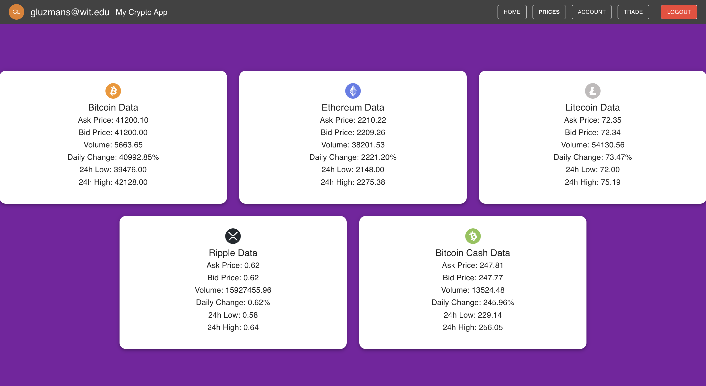
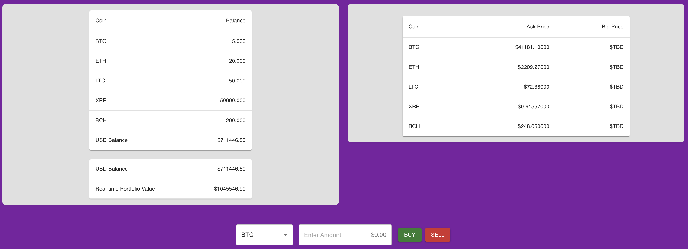

# Full-Stack Crypto Trading Simulator

## Project Overview

The Full-Stack Crypto Trading Simulator is a cutting-edge platform that replicates the fast-paced world of cryptocurrency trading. Developed using a combination of Django, React, Redis, and Auth0, this application offers a real-time trading experience, enabling users to participate in simulated trading competitions with a global user base or create custom competitions.

## Key Features

* Dynamic Front-End: Utilizes React alongside WebSockets for real-time user interaction and data presentation.

* Real-Time Data Processing: Leverages Django back-end with Kraken API integration for live market data.

* Concurrent User Communication: Implements Redis as a channel layer, enabling instant communication between users and the server.

* Simulated Trading Environment: Allows users to execute buy/sell transactions on live market data to simulate authentic trading.

* User Authentication and Management: Incorporates Auth0 to manage user sessions and maintain consistent state across interactions.

## backend functionalities:

* WebSocket Consumer for Kraken Data: Fetches and streams cryptocurrency data using WebSockets.

* User Profile Management: Handles user data and portfolio information, allowing for balance checks and coin management.

* Trading Logic: Executes trade operations, updating user profiles with the new balance and holdings after a trade is completed.

## Frontend Components
The front-end application provides several interactive components:

* Trading Interface: A React component that allows users to place buy or sell orders.

* Market Data Display: Shows live cryptocurrency prices updated in real-time.

* User Portfolio: Displays a summary of the user's current cryptocurrency holdings and account balance.

* Authentication Flow: Uses Auth0 to handle user authentication, registration, and session management.

## Final Goal: Algo & Manual Paper Trading Platform

The ultimate vision for the Full-Stack Crypto Trading Simulator is to establish a full-fledged platform that not only hosts global trading competitions but also empowers users with tools for algorithmic trading, providing a rich, interactive learning environment for traders of all levels.

Automated Strategy Execution: Users can create algorithms based on technical indicators and pre-defined logic to automatically execute trades, mirroring the capabilities used by professional traders.

Backtesting Tools: The platform will provide backtesting capabilities, allowing users to test their algorithms against historical data to evaluate performance and refine strategies.

Strategy Sharing and Collaboration: Traders can share their algorithms with the community, receive feedback, and collaborate to develop sophisticated trading strategies.

Global and Custom Competitions
The platform will offer a range of competition types, from global leaderboards to custom, user-created contests with diverse rules and setups:

Live Global Competitions: Regularly scheduled competitions where traders compete based on portfolio gains, with rankings and prizes to incentivize performance.

Customizable Contests: Users can set up private contests with friends or public competitions, choosing specific parameters like duration, starting capital, and selected cryptocurrencies.